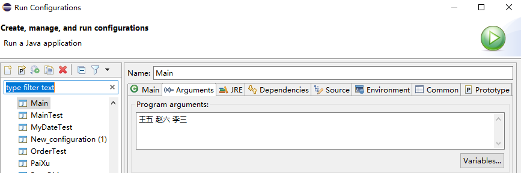

= OOP-下(面向对象 Object Oriented Programming)
:source-highlighter: highlight.js
:source-language: java
:toc: left
:toc-title: OOP-下
:toclevels: 3
:sectnums:

== static 关键字
=== 含义
静态的

=== 使用范围
属性、方法、代码块、内部类

=== static 修饰属性
* 称为：静态变量（类变量）

==== 实例变量与静态变量
属性，按是否使用 static 修饰分为：静态属性和非静态属性(实例变量)。

* **实例变量：**我们创建了类的多个对象，每个对象都独立的拥有一套类中的非静态属性。当修改其中一个对象中的非静态属性时，不会导致其他对象中同样的属性值的修改。
* **静态变量：**我们创建了类的多个对象，多个对象共享同一个静态变量。当通过某一个对象修改静态变量时，会导致其他对象调用此静态变量时，是修改过后的。

==== 静态变量说明
. 静态变量随着类的加载而加载。可以通过 `类.静态变量` 的方式进行调用。
. 静态变量的加载要早于对象的创建。
. 由于类只会加载一次，则静态变量在内存中也只会存在一份：**存在方法区的静态域中**。

==== 类变量与实例变量对比
[%header, cols="3*^.^"]
|===
||类变量|实例变量
|类|yes|no

|对象|yes|yes
|===
==== 静态属性举例
* System.out
* Math.PI

=== static 修饰方法
* 称为：静态方法

随着类的加载而加载，可以通过 `类.静态方法` 的方式进行调用。

==== 静态方法与非静态方法对比
[%header, cols="3*^.^"]
|===
||静态方法|非静态方法|
类|yes|no

|对象|yes|yes
|===
NOTE: 静态方法中，只能调用静态的方法或属性； +
非静态方法中，既可以调用非静态的方法或属性，也可以调用静态的方法或属性。

---
IMPORTANT: 在静态的方法内，不能使用this关键字、super关键字。 +
关于静态属性和静态方法的使用，可以从生命周期的角度去理解。

=== 确定一个属性或方法是否要声明 static
==== 属性
* 属性是可以被多个对象所共享的，不会随着对象的不同而不同的。
* 类中的常量也常常声明为static。

==== 方法
* 操作静态属性的方法，通常设置为static的。
* 工具类中的方法，习惯上声明为static的。 比如：Math、Arrays、Collections。

== 设计模式：单例(Singleton)设计模式
[discrete]
=== 什么是设计模式？
设计模式是在大量的实践中总结和理论化之后优选的代码结构、编程风格、以及解决问题的思考方式。设计模免去我们自己再思考和摸索。

TIP: 就像是经典的棋谱，不同的棋局，我们用不同的棋谱”套路”。

=== 概念
所谓类的单例设计模式，就是采取一定的方法保证在整个的软件系统中，对某个类只能存在一个对象实例。

=== 分类
==== 饿汉式
----
class Bank{
	
	//1.私有化类的构造器
	private Bank(){
		
	}
	
	//2.内部创建类的对象
	//4.要求此对象也必须声明为静态的
	private static Bank instance = new Bank();
	
	//3.提供公共的静态的方法，返回类的对象
	public static Bank getInstance(){
		return instance;
	}
}
----
NOTE: **坏处：**对象加载时间过长。 +
**好处：**饿汉式是线程安全的。

==== 懒汉式
----
class Order{
	
	//1.私有化类的构造器
	private Order(){
		
	}
	
	//2.声明当前类对象，没有初始化
	//4.此对象也必须声明为static的
	private static Order instance = null;
	
	//3.声明public、static的返回当前类对象的方法
	public static Order getInstance(){
		
		if(instance == null){
			
			instance = new Order();
			
		}
		return instance;
	}
	
}
----
NOTE: **好处：**延迟对象的创建。

---
CAUTION: 懒汉式暂时还存在线程安全问题，讲到多线程时，可修复。

=== 单例模式的优点
由于单例模式只生成一个实例，减少了系统性能开销，当一个对象的产生需要比较多的资源时，如读取配置、产生其他依赖对象时，则可以通过在应用启动时直接产生一个单例对象，然后永久驻留内存的方式来解决。

=== 应用场景
. **网站的计数器**，一般也是单例模式实现，否则难以同步。
. **应用程序的日志应用**，一般都使用单例模式实现，这一般是由于共享的日志文件一直处于打开状态，因为只能有一个实例去操作，否则内容不好追加。
. **数据库连接池**的设计一般也是采用单例模式，因为数据库连接是一种数据库资源。
. 项目中，**读取配置文件的类**，一般也只有一个对象。没有必要每次使用配置文件数据，都生成一个对象去读取。
. *Application* 也是单例的典型应用。
. Windows的**Task Manager** (任务管理器)就是很典型的单例模式。
. Windows的**Recycle Bin** (回收站)也是典型的单例应用。在整个系统运行过程中，回收站一直维护着仅有的一个实例。

== 理解main方法的语法
=== 说明
. main()方法作为程序的入口。
. main()方法也是一个普通的静态方法。
. main()方法可以作为我们与控制台交互的方式。（之前：使用Scanner）

=== 举例
.main()方法作为普通静态方法使用
----
public class MainTest {
	public static void main(String[] args) {
		Main.main(new String[100]);
	}
}
class Main{
	public static void main(String[] args) {
		for(int i = 0; i < args.length; i++) {
			args[i] = "args_" + i;
			System.out.println(args[i]);
		}
	}
}
----
.用main()方法与控制台交互
----
//先run一下，再在 Run Configurations 中的 Raguments--Program arguments输入数组 args 的元素运行，详情见下图。
class Main{
	public static void main(String[] args) {
		for(int i = 0; i < args.length; i++) {
			System.out.println(args[i]);
		}
	}
}
----
.用main()方法与控制台交互

== 代码块（或初始化块）
=== 4.1 作用
用来初始化类、对象。

=== 分类
代码块只能使用static修饰。

==== 静态代码块
形式：`static{}`

. 内部可以有输出语句。
. 随着类的加载而**执行**,而且只执行一次。
. **作用：**初始化类的信息。
. 如果一个类中定义了多个静态代码块，则按照声明的先后顺序执行。
. 静态代码块的执行要优先于非静态代码块的执行。
. 静态代码块内只能调用静态的属性、静态的方法，不能调用非静态的结构。

==== 非静态代码块
形式：`{}`

. 内部可以有输出语句。
. 随着对象的创建而**执行**。
. 每创建一个对象，就执行一次非静态代码块。
. **作用：**可以在创建对象时，对对象的属性等进行初始化。
. 如果一个类中定义了多个非静态代码块，则按照声明的先后顺序执行。
. 非静态代码块内可以调用静态的属性、静态的方法，或非静态的属性、非静态的方法。

[discrete]
=== 赋值的顺序
. 默认初始化
. 显式初始化
. 在代码块中赋值
. 构造器中初始化
. 有了对象以后，可以通过 `对象.属性` 或 `对象.方法` 的方式，进行赋值

== 关键字：final
=== 含义
最终的

=== 可修饰结构
==== 类
final 用来修饰一个类时此类不能被其他类所继承。 +
比如：String类、System类、StringBuffer类。

==== 方法
final 用来修饰方法时表明此方法不可以被重写。 +
比如：Object类中getClass()

==== 变量
final 用来修饰变量，此时"变量"就称为是一个常量。

* **修饰属性：**可以考虑赋值的位置有：显式初始化、代码块中初始化、构造器中初始化。
* **修饰局部变量：**尤其是使用final修饰形参时，表明此形参是一个常量。当我们调用此方法时，给常量形参赋一个实参。一旦赋值以后，就只能在方法体内使用此形参，但不能进行重新赋值。
          
NOTE: static final 用来修饰属性时称为全局常量。

== 关键字：abstract
[discrete]
=== 抽象类
随着继承层次中一个个新子类的定义，类变得越来越具体，而父类则更一般，更通用。类的设计应该保证父类和子类能够共享特征。有时将一个父类设计得非常抽象，以至于它没有具体的实例，这样的类叫做抽象类。

=== 含义
抽象的

=== 可修饰结构
类、方法

==== 抽象类
. 此类不能实例化。
. 抽象类中一定有构造器，便于子类实例化时调用（涉及：子类对象实例化的全过程）。
. 开发中，都会提供抽象类的子类，让子类对象实例化，完成相关的操作。

==== 抽象方法
. 抽象方法只有方法的声明，没有方法体。
. 包含抽象方法的类，一定是一个抽象类。反之，抽象类中可以没有抽象方法的。
. 若子类重写了父类中的所有的抽象方法后，此子类方可实例化。
. 若子类没有重写父类中的所有的抽象方法，则此子类也是一个抽象类，需要使用abstract修饰。

NOTE: 实现抽象类和接口中的抽象方法时，不能称为“重写”，叫做“实现”。

---

CAUTION: 不能用 abstract 修饰变量、代码块、构造器。 +
不能用 abstract 修饰私有方法、静态方法、final的方法、final的类。

=== 抽象类的匿名子类[[抽象类的匿名子类]]
.创建了匿名子类的非匿名对象：p
----
Person p = new Person(){

	@Override
	public void eat() {
		System.out.println("吃东西");
	}

	@Override
	public void breath() {
		System.out.println("好好呼吸");
	}
	
};

method1(p);
----
.创建匿名子类的匿名对象
----
method1(new Person(){
	@Override
	public void eat() {
		System.out.println("吃好吃东西");
	}

	@Override
	public void breath() {
		System.out.println("好好呼吸新鲜空气");
	}
});
----
.method1方法体
----
public static void method1(Person p){
p.eat();
p.breath();
}
----
== 设计模式：模板方法设计模式(TemplateMethod)
抽象类体现的就是一种模板模式的设计，抽象类作为多个子类的通用模板，子类在抽象类的基础上进行扩展、改造，但子类总体上会保留抽象类的行为方式。

=== 解决的问题
* 当功能内部一部分实现是确定的，一部分实现是不确定的。这时可以把不确定的部分暴露出去，让子类去实现。
* 换句话说，在软件开发中实现一个算法时，整体步骤很固定、通用，这些步骤已经在父类中写好了。但是某些部分易变，易变部分可以抽象出来，供不同子类实现。这就是一种模板模式。

=== 例子
.计算某段代码执行所需要花费的时间
----
abstract class Template{
	
	public void spendTime(){
		
		long start = System.currentTimeMillis();
		
		this.code();//不确定的部分、易变的部分
		
		long end = System.currentTimeMillis();
		
		System.out.println("花费的时间为：" + (end - start));
		
	}
	
	public abstract void code();
	
	
}

class SubTemplate extends Template{

	@Override
	public void code() {
		
		for(int i = 2;i <= 1000;i++){
			boolean isFlag = true;
			for(int j = 2;j <= Math.sqrt(i);j++){
				
				if(i % j == 0){
					isFlag = false;
					break;
				}
			}
			if(isFlag){
				System.out.println(i);
			}
		}

	}
	
}
----
=== 应用
- 数据库访问的封装
- Junit单元测试
- JavaWeb的Servlet中关于doGet/doPost方法调用
- Hibernate中模板程序
- Spring中JDBCTemlate、HibernateTemplate等

== 接口
=== 概述
. 接口使用 interface 来定义。
. Java中，接口和类是并列的两个结构。
+
NOTE: 或者可以理解为一种特殊的类。从本质上讲，接口是一种特殊的抽象类，这种抽象类中只包含常量和方法的定义。(JDK7.0及之前)，而没有变量和方法的实现。
. 接口的具体使用，体现多态性。
. 接口实际上可以看做是一种规范。
. 接口中没有构造器。
. 接口采用多继承机制。

=== 使用
JDK7 及以前，只能定义全局常量和抽象方法。 +
JDK8 中除了定义全局常量和抽象方法之外，还可以定义静态方法、默认方法（以下都为 JDK7 及之前的使用方法，JDK8 <<新增方法>>见后）。

. Java类可以实现多个接口，弥补了Java单继承性的局限性。 +
格式：`class AA extends BB implements CC,DD,EE {}`
. 接口与接口之间可以继承，而且可以多继承。 +
格式：`interface CC extends AA,BB {}`
. 实现类必须实现接口中所有的抽象方法或将实现类设置为抽象类。
+
NOTE: 实现抽象类和接口中的抽象方法时，不能称为“重写”，叫做“实现”。
. 接口中的所有成员变量都默认是由public static final修饰的。
. 接口中的所有抽象方法都默认是由public abstract修饰的。

.修饰词可省略
----
//全局常量
public static final int MAX_SPEED = 7900;//第一宇宙速度
int MIN_SPEED = 1;//省略了public static final
//抽象方法
public abstract void fly();
void stop();//省略了public abstract
----
=== 接口的匿名实现类的匿名对象
与抽象类一样，接口的实现类和对象也可以为匿名。（匿名与非匿名的实现类和对象，排列组合有四种使用方法） +
使用方法参照<<抽象类的匿名子类>>章节。

=== 面试题
.题一
----
interface A {
	int x = 0;
}

class B {
	int x = 1;
}

class C extends B implements A {
	public void pX() {
		//编译不通过。因为x是不明确的
		// System.out.println(x);
		//通过super调用父类中的x
		System.out.println(super.x);
		//接口中的x是全局常量，可直接通过接口来调用
		System.out.println(A.x);
		
	}

	public static void main(String[] args) {
		new C().pX();
	}
}
----
.题二
----
interface Playable {
	void play();
}

interface Bounceable {
	void play();
}

interface Rollable extends Playable, Bounceable {
	Ball ball = new Ball("PingPang");
}

class Ball implements Rollable {
	private String name;

	public String getName() {
		return name;
	}

	public Ball(String name) {
		this.name = name;
	}
	//接口和父类中的同名方法可以实现为一个方法
	public void play() {
		//此处的ball为实现自Rollable接口中创建的全局常量，不能再赋值
		ball = new Ball("Football");
		System.out.println(ball.getName());
	}
}
----
=== [[新增方法]]JDK8 新特性
==== 新特性及格式
===== 新特性
JDK8 中除了定义全局常量和抽象方法之外，还可以定义静态方法、默认方法。

===== 格式
.静态方法
----
public static void method1(){
	System.out.println("CompareA:北京");
}
	//public可省略
// static void method1(){
//     System.out.println("CompareA:北京");
// }
----
.默认方法
----
public default void method2(){
	System.out.println("CompareA：上海");
}
	//public可省略
// public default void method2(){
//     System.out.println("CompareA：上海");
// }
----
==== 说明及使用
. 接口中定义的静态方法，只能通过接口来调用。不能使用实现类或实现类的对象调用。
. 通过实现类的对象，可以调用接口中的默认方法。默认方法可以在实现类中重写。
. 如果子类(或实现类)继承的父类和实现的接口中声明了同名同参数的默认方法，那么子类在没有重写此方法的情况下，默认调用的是父类中的同名同参数的方法。
+
NOTE: 类优先原则
. 如果实现类实现了多个接口，而这多个接口中定义了同名同参数的默认方法，那么在实现类没有重写此方法的情况下，会报错。此时必须在实现类中重写此方法。
+
NOTE: 接口冲突
. 在子类(或实现类)的方法中调用父类、接口中被重写的同名同参数的默认方法：
+
----
public void myMethod(){
	method3();//调用自己定义的重写的方法
	super.method3();//调用父类中声明的
	CompareA.super.method3();//调用接口中的
}
----

== 设计模式：代理模式(Proxy)
=== 概述
- 代理模式是Java开发中使用较多的一种设计模式。代理设计就是为其他对象提供一种代理以控制对这个对象的访问。
- 代理模式是接口的应用。

=== 应用场景
. **安全代理：**屏蔽对真实角色的直接访问。
. **远程代理：**通过代理类处理远程方法调用（RMI）。
. **延迟加载：**先加载轻量级的代理对象，真正需要再加载真实对象比如你要开发一个大文档查看软件，大文档中有大的图片，有可能一个图片有100MB，在打开文件时，不可能将所有的图片都显示出来，这样就可以用代理模式，当需要查看图片时，用proxy来进行大图片的打开。

=== 分类
- 静态代理（静态定义代理类）
- 动态代理（动态生成代理类）
+
NOTE: JDK自带的动态代理，需要反射等知识

=== 代码举例
.例一
[%collapsible]
====
----
public class NetWorkTest {
	public static void main(String[] args) {
		Server server = new Server();
//		server.browse();
		ProxyServer proxyServer = new ProxyServer(server);
		
		proxyServer.browse();
		
	}
}

interface NetWork{
	
	public void browse();
	
}

//被代理类
class Server implements NetWork{

	@Override
	public void browse() {
		System.out.println("真实的服务器访问网络");
	}

}
//代理类
class ProxyServer implements NetWork{
	
	private NetWork work;
	
	public ProxyServer(NetWork work){
		this.work = work;
	}
	

	public void check(){
		System.out.println("联网之前的检查工作");
	}
	
	@Override
	public void browse() {
		check();
		
		work.browse();
		
	}
	
}
----
====
.例二
[%collapsible]
====
----
package com.atguigu.java;

public class StaticProxyTest {

	public static void main(String[] args) {
		Star s = new Proxy(new RealStar());
		s.confer();
		s.signContract();
		s.bookTicket();
		s.sing();
		s.collectMoney();
	}
}

interface Star {
	void confer();// 面谈

	void signContract();// 签合同

	void bookTicket();// 订票

	void sing();// 唱歌

	void collectMoney();// 收钱
}

class RealStar implements Star {

	public void confer() {
	}

	public void signContract() {
	}

	public void bookTicket() {
	}

	public void sing() {
		System.out.println("明星：歌唱~~~");
	}

	public void collectMoney() {
	}
}

class Proxy implements Star {
	private Star real;

	public Proxy(Star real) {
		this.real = real;
	}

	public void confer() {
		System.out.println("经纪人面谈");
	}

	public void signContract() {
		System.out.println("经纪人签合同");
	}

	public void bookTicket() {
		System.out.println("经纪人订票");
	}

	public void sing() {
		real.sing();
	}

	public void collectMoney() {
		System.out.println("经纪人收钱");
	}
}
----
====
== 设计模式：工厂模式
=== 概述
- 实现了创建者与调用者的分离，即将创建对象的具体过程屏蔽隔离起来，达到提高灵活性的目的。
- 接口的应用：工厂模式

=== 面向对象的设计原则
详见<<工厂设计模式链接指引>>。

=== 工厂模式的分类
- 简单工厂模式：用来生产同一等级结构中的任意产品。（对于增加新的产品，需要修改已有代码）
- 工厂方法模式：用来生产同一等级结构中的固定产品。（支持增加任意产品）
- 抽象工厂模式：用来生产不同产品族的全部产品。（对于增加新的产品，无能为力；支持增加产品族）

=== [[工厂设计模式链接指引]]《拓展：工厂设计模式》链接指引
点击link:拓展：工厂设计模式.pdf[此处]了解更多。

== 内部类
=== 使用场景
当一个事物的内部，还有一个部分需要一个完整的结构进行描述，而这个内部的完整的结构又只为外部事物提供服务，那么整个内部的完整结构最好使用内部类。

=== 概述
- Java中允许将一个类A声明在另一个类B中，则类A就是内部类，类B称为外部类。
+
NOTE: 内部类和外部类不能同名

- 内部类仍然是一个独立的类，在编译之后内部类会被编译成独立的.class文件，但是前面冠以外部类的类名和$符号，以及数字编号。

=== 分类
==== 成员内部类
静态、非静态

===== 作为外部类的成员
- 可以调用外部类的结构
- 可以被static修饰
- 可以被4种不同的权限修饰

===== 作为一个类
- 类内可以定义属性、方法、构造器等
- 可以被final修饰，表示此类不能被继承。
+
NOTE: 言外之意，不使用final，就可以被继承
- 可以被abstract修饰

==== 局部内部类
方法内、代码块内、构造器内

===== 注意点
局部内部类可以使用外部方法的局部变量，但是必须是final的（JDK8 中默认是final，故关键字final可省略；JDK7 及之前会报错）。

NOTE: 由局部内部类和局部变量的声明周期不同所致。 +
局部内部类编译时可以看出是一个单独的类，而外部方法的局部变量出了方法体理应失效，局部内部类实际调用的是外部方法的局部变量的副本。

 
=== 主要关注点
==== 实例化成员内部类的对象
- 创建静态的成员内部类(Dog)： +
`Person.Dog dog = new Person.Dog();`
- 创建非静态的成员内部类(Bird)： +
`Person p = new Person(); +
Person.Bird bird = p.new Bird();`

==== 在成员内部类中区分调用外部类的结构
见如下代码：

.非静态内部类Bird中的方法display
----
public void display(String name){
		//内部类方法中调用方法的形参
		System.out.println(name);<1>
		//调用内部类(Bird)的属性
		System.out.println(this.name);<2>
		//调用外部类(Person)的属性
		System.out.println(Person.this.name);<3>
	}
----
<1> 调用方法的形参
<2> 调用内部类(Bird)的属性
<3> 调用外部类(Person)的属性

NOTE: 内外部类有同名属性/方法时才需要写完整，否则可以省略直接写属性/方法名。

==== 开发中局部内部类的使用
.返回一个实现了Comparable接口的类的对象
----
public Comparable getComparable(){
	
	//创建一个实现了Comparable接口的类:局部内部类
	//方式一：
	class MyComparable implements Comparable{

		@Override
		public int compareTo(Object o) {
			return 0;
		}
		
	}
	
	return new MyComparable();
	
	//方式二(匿名)：
	// return new Comparable(){

	// 	@Override
	// 	public int compareTo(Object o) {
	// 		return 0;
	// 	}
		
	// };
	
}
----