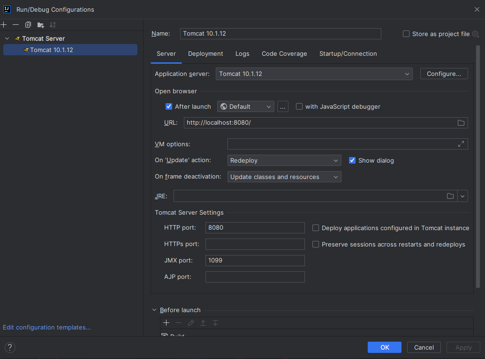
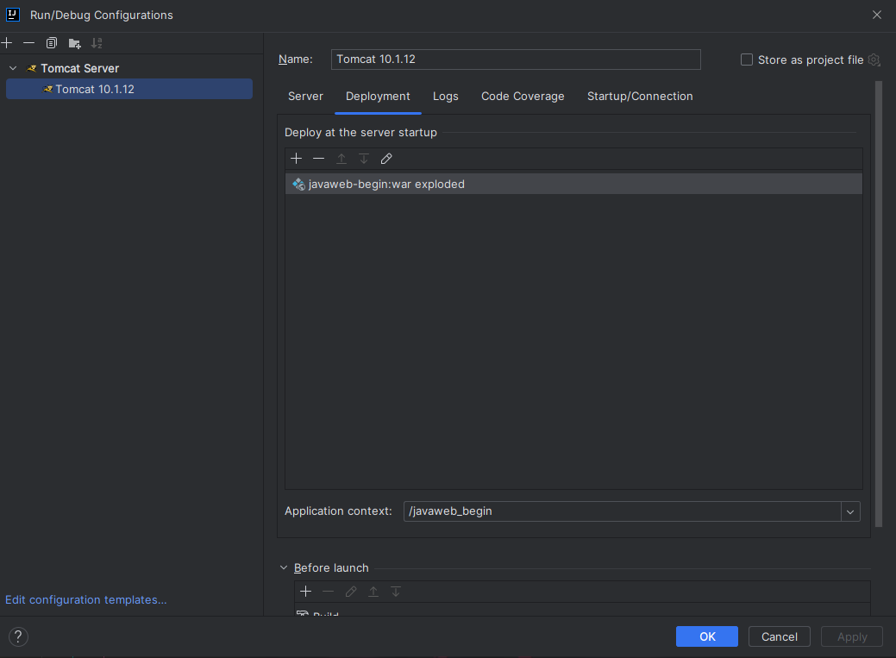

= Tomcat 服务器
:source-highlighter: highlight.js
:source-language: java
:toc: left
:toc-title: Tomcat 服务器
:toclevels: 3
:sectnums:

== JavaWeb 的概念
=== 概念
JavaWeb 是指，所有通过 Java 语言编写可以通过浏览器访问的程序的总称，叫JavaWeb。JavaWeb 是基于请求和响应来开发的。

=== 请求和响应
- 请求 +
请求是指客户端给服务器发送数据，叫请求 Request
- 响应 +
响应是指服务器给客户端回传数据，叫响应 Response
- 请求和响应的关系 +
请求和响应是成对出现的，有请求就有响应

=== Web 资源的分类
web 资源按实现的技术和呈现的效果的不同，分为静态资源和动态资源两种。

- 静态资源： html、css、js、txt、mp4、jpg
- 动态资源： jsp 页面、Servlet 程序

=== 常用的Web服务器
- Tomcat：由 Apache 组织提供的一种 Web 服务器，提供对 jsp 和 Servlet 的支持。它是一种轻量级的javaWeb容器（服务器），也是当前应用最广的 JavaWeb 服务器（免费）。
- Jboss：是一个遵从 JavaEE 规范的、开放源代码的、纯 Java 的 EJB 服务器，它支持所有的JavaEE 规范（免费）。
- GlassFish： 由 Oracle 公司开发的一款 JavaWeb 服务器，是一款强健的商业服务器，达到产品级质量（应用很少）。
- Resin：是 CAUCHO 公司的产品，是一个非常流行的服务器，对 servlet 和 JSP 提供了良好的支持，性能也比较优良，resin 自身采用 JAVA 语言开发（收费，应用比较多）。
- WebLogic：是 Oracle 公司的产品，是目前应用最广泛的 Web 服务器，支持 JavaEE 规范，而且不断的完善以适应新的开发要求，适合大型项目（收费，用的不多，适合大公司）。

== Tomcat的使用
=== Tomcat版本规范及下载
见官网： https://tomcat.apache.org/whichversion.html[Tomcat版本规范]

=== 目录介绍
- `bin` 存放 Tomcat 服务器的可执行程序
- `conf` 存放 Tocmat 服务器的配置文件
- `lib` 存放 Tomcat 服务器的 jar 包
- `logs` 存放 Tomcat 服务器运行时输出的日记信息
- `temp` 存放 Tomcdat 运行时产生的临时数据
- `webapps` 存放部署的 Web 工程
- `work` 是 Tomcat 工作时的目录，用来存放 Tomcat 运行时 jsp 翻译为 Servlet 的源码，和Session钝化的目录

=== 启动与关闭
. 启动： +
双击Tomcat目录下的bin目录下的 startup.bat 文件；或打开cmd在Tomcat的bin目录下输入catalina run
. 测试： +
在浏览器地址栏中输入以下地址：
* localhost:8080
* 127.0.0.1:8080
* 真实ip:8080
. 关闭： +
关闭Tomcat窗口；在Tomcat键入ctrl + c；双击Tomcat的bin目录下的shutdown.bat

=== 修改Tomcat端口号
Tomcat 目录下的 conf 目录，找到 server.xml 配置文件进行修改。修改后需重启服务。

=== 部暑 web 工程到Tomcat
- 方法一：将 web 工程的目录拷贝到Tomcat 的webapps目录下。
- 方法二：在目录Tomcat/conf/Catalina/localhost下创建 `工程名.xml` 的文件，内容如下：
----
<!-- Context 表示一个工程上下文
path 表示工程的访问路径:/abc
docBase 表示你的工程目录在哪里
-->
<Context path="/abc" docBase="E:\book" />
----

=== 浏览器打开工程页面
- 访问root工程：localhost:8080
- 访问指定工程：localhost:8080/工程名

== IDEA 整合Tomcat服务器
. 创建web工程
. 配置服务器：
+

. 部署项目：
+

NOTE: 建议每创建的一个项目都单独配置服务器再部署，在一个服务器部署的项目在点击运行时会全都启动

== 工程目录结构说明
- src 目录存在自己编写的java源代码
- web 目录专门用来存放web工程的资源文件。比如：html页面、css文件、js文件等等
* WEB-INF 目录是一个受服务器保护的目最，浏览器无法直接访问到此目录的内容
** lib 目录用来存放第三方的jar(该目录为自己创建)
** web.xml 它是整个动态web工程的配置部暑描述文件，可以在这些配置很多wb工程的组件，比如：Servlet程序、Filter过滤器、Listener监听器、Session超时等等