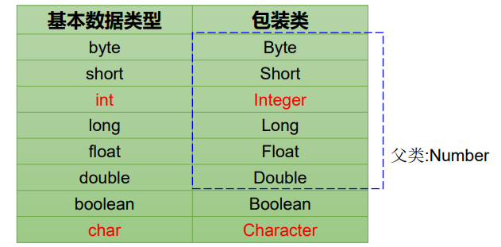
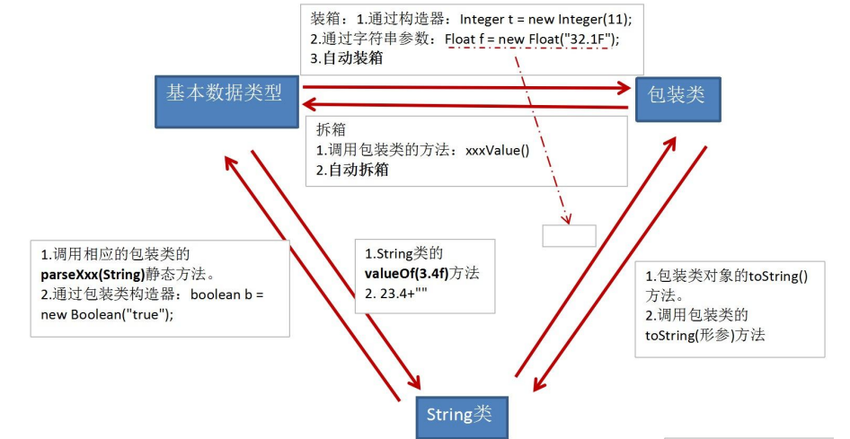

= OOP-中(面向对象 Object Oriented Programming)
:source-highlighter: highlight.js
:toc: left
:toc-title: OOP-中
:toclevels: 3
:sectnums:

== 继承 extends
=== 继承性的好处
. 减少了代码的冗余，提高了代码的复用性。
. 便于功能的扩展。
. 为之后多态性的使用，提供了前提。

=== 继承性的格式
[source, java]
----
class A extends B {

}
----
NOTE: A:子类、派生类、subclass +
B:父类、超类、基类、superclass

=== 说明
. 一旦子类A继承父类B以后，子类A中就获取了父类B中声明的所有的属性和方法。父类中声明为private的属性或方法，子类继承父类以后，仍然认为获取了父类中私有的结构。只有因为封装性的影响，使得子类不能直接调用父类的结构而已。
. 一个类可以被多个子类继承。
. 一个类只能有一个父类。
. 类可以多级继承。子类直接继承的父类，称为：直接父类。间接继承的父类称为：间接父类。

== Object类
. 如果我们没有显式的声明一个类的父类的话，则此类继承于java.lang.Object类。
. 所有的java类（除java.lang.Object类之外）都直接或间接的继承于java.lang.Object类。
. 意味着，所有的java类具有java.lang.Object类声明的功能。

== 方法的重写(override / overwrite)
=== 概念
子类继承父类以后，可以对父类中同名同参数的方法，进行覆盖操作。

=== 应用
重写以后，当创建子类对象以后，通过子类对象调用子父类中的同名同参数的方法时，实际执行的是子类重写父类的方法。

=== 规定
----
方法的声明： 权限修饰符  返回值类型  方法名(形参列表) throws 异常的类型{
    //方法体
}
----
NOTE: 约定俗称：子类中的叫重写的方法，父类中的叫被重写的方法

. 子类重写的方法的方法名和形参列表与父类被重写的方法的方法名和形参列表相同。
. 子类重写的方法的权限修饰符不小于父类被重写的方法的权限修饰符。

 特殊情况：子类不能重写父类中声明为private权限的方法。

. 返回值类型
.. 父类被重写的方法的返回值类型是void，则子类重写的方法的返回值类型只能是void。
.. 父类被重写的方法的返回值类型是A类型，则子类重写的方法的返回值类型可以是A类或A类的子类。
.. 父类被重写的方法的返回值类型是基本数据类型(比如：double)，则子类重写的方法的返回值类型必须是相同的基本数据类型（必须也是double）。
. 子类重写的方法抛出的异常类型不大于父类被重写的方法抛出的异常类型（具体放到异常处理时候讲）。
. 子类和父类中的同名同参数的方法要么都声明为非static的（考虑重写），要么都声明为static的（static的不是叫重写）。

== super关键字的使用
=== 概述
* super理解为：父类的。
* super可以用来调用：属性、方法、构造器。

=== super的使用
==== 调用属性和方法
. 我们可以在子类的方法或构造器中。通过使用"super.属性"或"super.方法"的方式，显式的调用父类中声明的属性或方法。但是，通常情况下，我们习惯省略"super."。
. 特殊情况：当子类和父类中定义了同名的属性时，我们要想在子类中调用父类中声明的属性，则必须显式的使用"super.属性"的方式，表明调用的是父类中声明的属性。
. 特殊情况：当子类重写了父类中的方法以后，我们想在子类的方法中调用父类中被重写的方法时，则必须显式的使用"super.方法"的方式，表明调用的是父类中被重写的方法。

==== super调用构造器
. 我们可以在子类的构造器中显式的使用"super(形参列表)"的方式，调用父类中声明的指定的构造器。
. "super(形参列表)"的使用，必须声明在子类构造器的首行！
. 我们在类的构造器中，针对于"this(形参列表)"或"super(形参列表)"只能二选一，不能同时出现。
. 在构造器的首行，没有显式的声明"this(形参列表)"或"super(形参列表)"，则默认调用的是父类中空参的构造器：super()。
. 在类的多个构造器中，至少有一个类的构造器中使用了"super(形参列表)"，调用父类中的构造器。

== this和super的区别
[%header, cols="3*^.^"]
|===
|区别点|this|super

|调用属性
|访问本类中的属性，如果本类没有此属性则从父类中继续查找
|直接访问父类中的属性

|调用方法
|访问本类中的方法，如果本类没有此方法则从父类中继续查找
|直接访问父类中的方法

|调用构造器
|调用本类构造器，必须放在构造器的首行
|调用父类构造器，必须放在子类构造器的首行
|===

== 多态性
=== 理解多态性
可以理解为一个事物的多种形态。

=== 何为多态性
对象的多态性：父类的引用指向子类的对象（或子类的对象赋给父类的引用）。

.举例
[source, java]
----
Person e = new Student();//Student是Person子类
e.getInfo(); //调用的是Student类的getInfo()方法
----
=== 多态的使用
**虚拟方法调用**

 有了对象的多态性以后，我们在编译期，只能调用父类中声明的方法，但在运行期，我们实际执行的是子类重写父类的方法。

TIP: 编译，看左边；运行，看右边。

=== 多态性的使用前提
* 类的继承关系  
* 方法的重写

NOTE: 对象的多态性，只适用于方法，不适用于属性。属性的编译和运行都看左边。

[discrete]
==== 早绑定与晚绑定
对于重载而言，在方法调用之前，编译器就已经确定了所要调用的方法， 这称为“早绑定”或“静态绑定”； +
而对于多态，只有等到方法调用的那一刻，解释运行器才会确定所要调用的具体 方法，这称为“晚绑定”或“动态绑定”。

NOTE: 多态是运行时行为

=== 多态性的应用举例
.举例一
[source, java]
----
public void func(Animal animal){//Animal  animal = new Dog();
        animal.eat();
        animal.shout();
    }
----
.举例二
[source, java]
----
public void method(Object obj){
        
    }
----
.举例三
[source, java]
----
class Driver{
     
     public void doData(Connection conn){//conn = new  MySQlConnection(); / conn = new OracleConnection();
           //规范的步骤去操作数据
//         conn.method1();
//         conn.method2();
//         conn.method3();
           
     }
     
}
----
== 向上转型和向下转型
=== 概述
向上转型即多态；向下转型为强制转换。
有了对象的多态性以后，内存中实际上是加载了子类特有的属性和方法的，但是由于变量声明为父类类型，导致编译时，只能调用父类中声明的属性和方法。子类特有的属性和方法不能调用。

=== 调用子类特有的属性和方法
向下转型：使用强制类型转换符。

.例
[source, java]
----
Man m1 = (Man)p2;
m1.earnMoney();
m1.isSmoking = true;
----
CAUTION: 使用强转时，可能出现ClassCastException的异常。

.例
[source, java]
----
Woman w1 = (Woman)p2;
w1.goShopping();
----
=== 图示
image::images\\向上转型与向下转型.png[align="center"]

== instanceof关键字的使用
=== 语法格式
`a instanceof A`

判断对象a是否是类A的实例。如果是，返回true；如果不是，返回false。“A”必须是“a”的子类或父类，否则编译器会报错。

=== 使用情境
为了避免在向下转型时出现ClassCastException的异常，我们在向下转型之前，先进行instanceof的判断，一旦返回true，就进行向下转型。如果返回false，不进行向下转型。

.例
[source, java]
----
if(p2 instanceof Woman){
    Woman w1 = (Woman)p2;
    w1.goShopping();
    System.out.println("******Woman******");
}
----
NOTE: 如果 a instanceof A返回true,则 a instanceof B也返回true。其中，类B是类A的父类。

== java.lang.Object类
=== 概述
. Object类是所有Java类的根父类
. 如果在类的声明中未使用extends关键字指明其父类，则默认父类为java.lang.Object类
. Object类中的功能(属性、方法)具有通用性。

* 属性：无
* 方法：equals() / toString() / getClass() / hashCode() / clone() / finalize() / wait() 、 notify()、notifyAll()

. Object类只声明了一个空参的构造器.

=== Object类：“==”运算符
. 可以使用在基本数据类型变量和引用数据类型变量中。
. 如果比较的是基本数据类型变量：比较两个变量保存的数据是否相等。（不一定类型要相同） +
如果比较的是引用数据类型变量：比较两个对象的地址值是否相同，即两个引用是否指向同一个对象实体。
. == 符号使用时，必须保证符号左右两边的变量类型一致。

.例
[source, java]
----
char ch1 = 'A'; char ch2 = 12; 
System.out.println("65和'A'是否相等？" + (it == ch1));//true System.out.println(“12和ch2是否相等？" + (12 == ch2));//true
----

=== Object类：equals()方法
==== 概述
. 是一个方法，而非运算符。
. 只能适用于引用数据类型。

.Object类中equals()的定义
[source, java]
----
     public boolean equals(Object obj) {
            return (this == obj);
      }
----
NOTE: Object类中定义的equals()和==的作用是相同的：比较两个对象的地址值是否相同,即两个引用是否指向同一个对象实体。

==== equals()的重写
. 像String、Date、File、包装类等都重写了Object类中的equals()方法。重写以后，比较的不是两个引用的地址是否相同，而是比较两个对象的"实体内容"是否相同。
. 通常情况下，我们自定义的类如果使用equals()的话，也通常是比较两个对象的"实体内容"是否相同。那么，我们就需要对Object类中的equals()进行重写。

NOTE: 重写的原则：比较两个对象的实体内容是否相同。

=== Object类：toString()
==== 概述
. 当我们输出一个对象的引用时，实际上就是调用当前对象的toString()。

.Object类中toString()的定义
[source, java]
----
public String toString() {
    return getClass().getName() + "@" + Integer.toHexString(hashCode());
}
----
==== toString()的重写
. 像String、Date、File、包装类等都重写了Object类中的toString()方法，使得在调用对象的toString()时，返回"实体内容"信息。
. 自定义类也可以重写toString()方法，当调用此方法时，返回对象的"实体内容"

== Java中的JUnit单元测试
[discrete]
=== 步骤
. 选中当前工程 - 右键选择：build path - add libraries - JUnit 4 - 下一步。
. 创建Java类，进行单元测试。此时的Java类要求：① 此类是public的  ②此类提供公共的无参的构造器。
. 此类中声明单元测试方法。此时的单元测试方法：方法的权限是public,没有返回值，没有形参。
. 此单元测试方法上需要声明注解：@Test,并在单元测试类中导入：import org.junit.Test;。
. 声明好单元测试方法以后，就可以在方法体内测试相关的代码。
. 写完代码以后，左键双击单元测试方法名，右键：run as - JUnit Test。

NOTE: 如果执行结果没有任何异常：绿条 +
如果执行结果出现异常：红条

== 包装类(Wrapper)以及与基本数据类型、String类的相互转换
=== 基本数据类型与包装类对比
.基本数据类型与对应包装类

=== 包装类的转换
.基本类型、包装类与String类间的转换

.举例
[source, java]
----
//自动装箱：基本数据类型 --->包装类
int num2 = 10;
Integer in1 = num2;//自动装箱
Integer in1 = new Integer(num2)//通过构造器的方法已弃用
boolean b1 = true;
Boolean b2 = b1;//自动装箱

//自动拆箱：包装类--->基本数据类型
System.out.println(in1.toString());
int num3 = in1;//自动拆箱

//基本数据类型、包装类--->String类型
int num1 = 10;
//方式1：连接运算
String str1 = num1 + "";
//方式2：调用String的valueOf(Xxx xxx)
float f1 = 12.3f;
String str2 = String.valueOf(f1);//"12.3"
       
Double d1 = new Double(12.4);
String str3 = String.valueOf(d1);

//String类型 --->基本数据类型、包装类：调用包装类的parseXxx(String s)
String str1 = "123";
int num2 = Integer.parseInt(str1);
System.out.println(num2 + 1);//基本数据类型才能做运算
       
String str2 = "true";
boolean b1 = Boolean.parseBoolean(str2);
----
NOTE: 总结：
基本数据类型和包装类之间转换用“自动拆装箱”； +
基本数据类型和包装类转String用String.valueOf(Xxx xxx)； +
String转包装类和基本数据类型调用包装类的parseXxx(String s)。

== 包装类面试题
[source, java]
----
Integer m = 1;
Integer n = 1;
System.out.println(m == n);//true

Integer x = 128;//相当于new了一个Integer对象
Integer y = 128;//相当于new了一个Integer对象
System.out.println(x == y);//false
----
Integer内部定义了IntegerCache结构，IntegerCache中定义了Integer[]，保存了从-128到127范围的整数。如果我们使用自动装箱的方式，给Integer赋值的范围在-128到127范围内时，可以直接使用数组中的元素，不用再去new了。

NOTE: 目的：提高效率